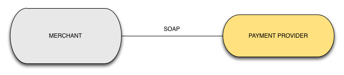
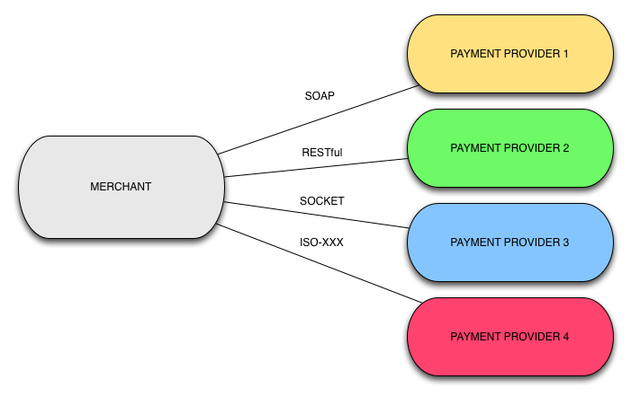
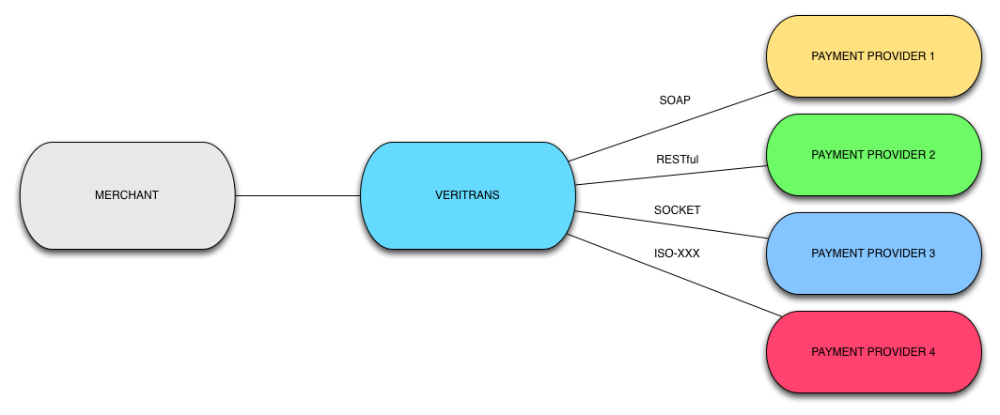
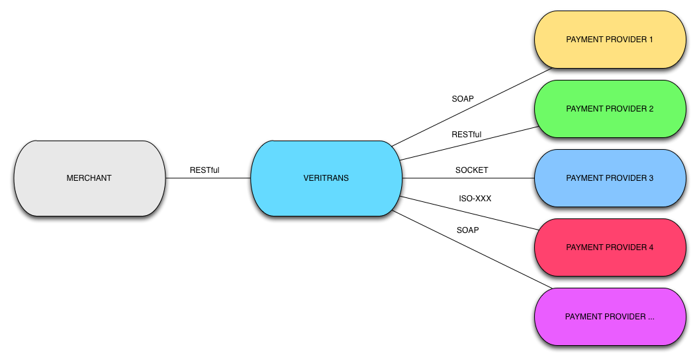

<== [Daftar Isi](../README.md)

1. Pengenalan Sistem Pembayaran Veritrans
=========================================

Sebelum kita masuk ke materi, sebelumnya saya mau bahas dulu tentang perusahaan Veritrans Indonesia, dan kenapa Merchant (Toko Online) sangat saya rekomendasikan menggunakan perusahaan Online Payment Gateway seperti Veritrans Indonesia dibandingkan melakukan implementasi sendiri untuk menyediakan pembayaran online di website-nya. 

## 1.1 Veritrans Indonesia

Veritrans Indonesia (PT. Midtrans) merupakan perusahaan penyedia layanan pembayaran online untuk pasar Indonesia. Salah satu kehebatan Veritrans Indonesia adalah mereka dapat menyederhanakan berbagai jenis metode pembayaran (Kartu Kredit, Internet Banking, Virtual Account, Mobile Payment) menjadi satu pintu sehingga Merchant akan sangat dimudahkan untuk integrasi. 

Apakah Merchant bisa mengimplementasikan pembayaran online sendiri tanpa harus menggunakan Veritrans Indonesia? Yup, tentu bisa, tapi saya sangat tidak rekomendasikan. Kenapa? karena setiap metode pembayaran memiliki spesifikasi sistem yang berbeda-beda, dan belum lagi banyaknya sertifikasi yang harus dimiliki Merchant untuk metode pembayaran tertentu (seperti PCI DSS untuk kartu kredit), hal ini bukannya mempercepat integrasi, malah memperlambat, bahkan mempersulit proses integrasi. Jika Merchant menggunakan Online Payment Gateway seperti Veritrans Indonesia, Merchant dapat dengan mudah mengintegrasikan sistem pembayaran online, karena semua kerumitan yang terjadi di belakangnya sudah ditangani oleh pihak Veritrans Indonesia, jadi Merchant tinggal duduk santai saja, enaaaakkkk :D

Veritrans Indonesia memiliki sebuah konsep ONE MESSAGE, ONE RESPONSE and ONE ENDPOINT untuk sistem pembayaran online mereka. 

- <b>ONE MESSAGE</b> artinya, untuk melakukan metode pembayaran apapun, Merchant hanya menggunakan satu format pesan yang sama. 
- <b>ONE RESPONSE</b> artinya, semua metode pembayaran apapun yang dilakukan oleh Merchant, maka response yang diberikan oleh sistem Veritrans Indonesia akan menggunakan format pesan yang sama.
- <b>ONE ENDPOINT</b> artinya, semua metode pembayaran apapun yang dilakukan menggunakan satu endpoint (pintu) yang sama.

Hal ini menjadikan Merchant akan lebih mudah melakukan integrasi dengan Veritrans Indonesia, karena semua format pesan untuk metode pembayaran apapun sama. Semua kompleksitas yang terjadi dibelakang akan ditangani oleh sistem Veritrans Indonesia, tanpa harus diketahui oleh Merchant.

## 1.2 Metode Pembayaran

Apa saja metode pembayaran yang didukung oleh Veritrans Indonesia? Berikut adalah daftar metode pembayaran yang didukung oleh Veritrans Indonesia :

- Kartu Kredit
	- Normal
	- Cicilan
	- Poin
	- PreAuthorize
	- 3D Secure
	- Recurring (One Click Button)
	- Two Click Button
- Internet Banking
	- CIMB Clicks
	- Mandiri Clickpay
	- BRI Epay
	- BCA KlikPay
	- KlikBCA
- Virtual Account (ATM)
	- Permata
	- BII
- Mobile Payment
	- XL Tunai
	- Telkomsel TCash
	
Wow, banyak sekali! Jika Merchant menggunakan Veritrans Indonesia sebagai Online Payment Gateway-nya, maka semua metode pembayaran tersebut dapat digunakan hanya menggunakan satu pintu (API)

## 1.3 Cara Kerja Payment Gateway

Jika Anda masih bingung tentang cara kerja Online Payment Gateway yang terintegrasi dengan Merchant, yuk kita bahas :)

Seandainya Merchant melakukan integrasi secara langsung dengan Payment Provider (penyedia metode pembayaran), maka seperti ini diagram nya :

Namun bayangkan jika Merchant melakukan integrasi dengan beberapa Payment Provider, maka diagramnya akan terlihat seperti ini :

Merchant perlu implementasi secara manual untuk melakukan integrasi ke semua Payment Provider. Namun hal ini berbeda jika Merchant menggunakan Payment Gateway untuk integrasi ke semua Payment Provider.

Bahkan seandainya ada penambahan Payment Provider baru di sistem Payment Gateway, Merchant tidak perlu melakukan development lagi, karena semua sudah dilakukan di sistem Payment Gateway.

Intinya Payment Gateway bertugas untuk mengirim data transaksi (tagihan Merchant ke Pelanggan) ke Payment Provider yang telah ditentukan, sehingga Merchant tidak perlu pusing lagi dengan cara pembayaran & metode pembayaran yang akan dilakukan pelanggan. Merchant hanya perlu mengirim data transaksi, dan menunggu Payment Gateway melakukan konfirmasi apakah pembayaran dari pelanggan berhasil atau gagal.

## 1.4 Merchant Veritrans Indonesia

Sampai saat ini sudah banyak sekali Merchant yang telah melakukan integrasi dengan Veritrans Indonesia, diantaranya Rakuten Belanja Online, BizNet, Blitz Megaplex, Jeruk Nipis, BerryBenka, Traveloka, Sribu.com, Teknoup, Wayang, Loket dan [masih banyak yang lainnya](https://www.veritrans.co.id/portfolio.html).

## 1.5 Veritrans Fraud Detection System

Salah satu kelebihan Veritrans Indonesia adalah sistem Veritrans telah terintegrasi dengan Fraud Detection System, yaitu sistem pintar yang bisa mencoba menganalisa transaksi untuk ditentukan apakah transaksi tersebut dicurigai mengandung unsur penipuan atau tidak. FDS (Fraud Detection System) Veritrans Indonesia berjalan secara Real Time, sehingga Merchant dapat melihat hasilnya langsung ketika transaksi dilakukan.

## 1.6 Produk Veritrans

Sampai saat ini, terdapat 3 produk Veritrans Indonesia yang dapat digunakan oleh Merchant untuk memudahkan sistem pembayaran secara online, yaitu; VTDirect, VTWeb dan VTLink.

### 1.6.1 VTDirect

VTDirect adalah sistem Veritrans yang terintegrasi dengan sistem Merchant secara server-to-server. Jika Merchant menggunakan VTDirect, Merchant bisa membuat form pembayaran sendiri, sesukanya. Saat melakukan transaksi dari Merchant, maka sistem Merchant akan mengirimnya server-to-server ke sistem Veritrans.

VTDirect cocok sekali untuk Merchant-Merchant besar, karena dengan menggunakan VTDirect, pelanggan bisa langsung bayar di halaman  website Merchant, tanpa harus masuk ke halaman website Veritrans. Salah satu kekurangan di VTDirect adalah, Merchant dituntut membuat halaman pembayarannya sendiri, jadi jika sewaktu-waktu Veritrans menyediakan metode pembayaran baru, misal Bank XXX ClickPay, maka otomatis Merchant harus membuat halaman pembayaran lagi.

### 1.6.2 VTWeb

VTWeb adalah sistem Veritrans yang berjalan sebagai website redirect. Ketika melakukan pembayaran, Merchant akan meminta pelanggan untuk melakukan pembayaran di website Veritrans dan nanti hasilnya akan dikirim server-to-server ke sistem Merchant oleh Veritrans.

VTWeb cocok sekali untuk Merchant-Merchant kecil, karena salah satunya tidak terdapat biaya bulanan. Selain itu dengan menggunakan VTWeb, Merchant tidak perlu pusing-pusing lagi membuat form halaman pembayaran, karena halaman pembayarannya sudah disediakan oleh Veritrans. Bahkan jika sewaktu-waktu ada metode pembayaran baru, Merchant tidak perlu melakukan apapun, otomatis Veritrans yang akan menambah halaman pembayaran di website-nya.

### 1.6.3 VTLink

VTLink adalah sistem Veritrans untuk mempermudah penjualan di social media seperti Facebook dan Twitter. VTLink sebenarnya peningkatan kemampuan dari VTWeb, dimana Merchant bisa memasukkan daftar produk (nama + harga) yang akan dijual ke sistem Veritrans, nanti sistem Veritrans akan memberikan link (tautan) yang dapat digunakan untuk melakukan pembelian terhadap produk tersebut.

VTLink cocok sekali untuk Merchant-Merchant yang memanfaatkan media sosial untuk berjualan, bahkan tanpa harus membuat toko online, Merchant bisa berjualan menggunakan VTLink, karena nanti transaksi yang berhasil akan dikirim email ke Merchant, sehingga Merchant tahu apakah ada transaksi penjualan atau tidak.

==> [Pengenalan Sistem Sandbox Veritrans](../02-sandbox/README.md)