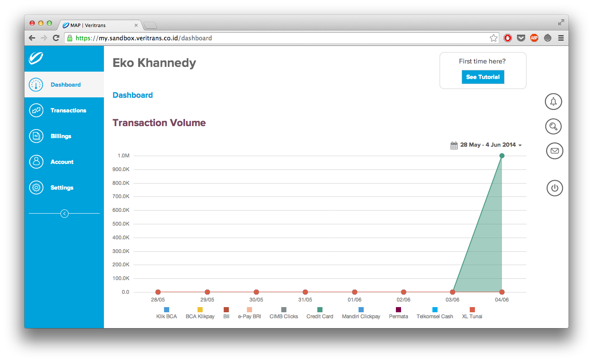
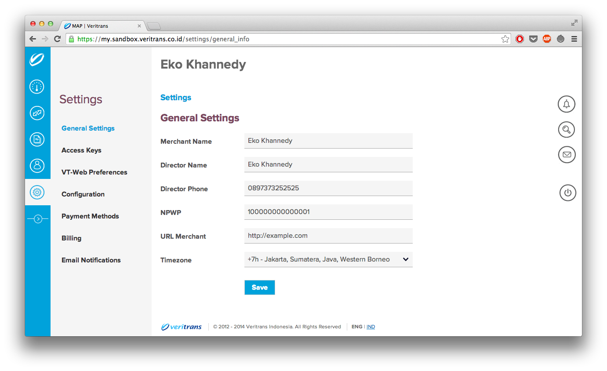

<== [Pengenalan Sistem Pembayaran Veritrans](../01-pengenalan/README.md)

2. Pengenalan Sistem Sandbox Veritrans
=========================================

Salah satu yang saya suka dari Veritrans Indonesia adalah mereka memiliki sistem sandbox yang dapat digunakan sebelum kita melakukan transaksi asli, dalam artian kita bisa melakukan transaksi palsu dahulu untuk mencoba apakah integrasi dengan sistem Veritrans Indonesia sudah berjalan dengan baik atau belum. 

Untuk menggunakan sistem sanbox Veritrans Indonesia, kita dapat menggunakannya secara cuma-cuma alias gratis, bahkan tanpa perlu melakukan konfirmasi manual ke pihak Veritrans Indonesia. Untuk mencobanya kita bisa melakukan pendaftaran ke sistem sandbox Veritrans Indonesia di [https://my.sandbox.veritrans.co.id/](https://my.sandbox.veritrans.co.id/)

## 2.1 Merchant Administration Portal

MAP (Merchant Administration Portal) adalah website yang telah disediakan oleh Veritrans Indonesia untuk me-monitor transaksi Merchant secara real time. Didalam MAP juga Merchant dapat melihat metode pembayaran yang telah aktif ,pengaturan untuk proses integrasi dan juga dokumentasi cara penggunaan Veritrans Payment API.

### 2.1.1 Dashboard

Pada bagian dashboard MAP, kita dapat melihat summary dari total transaksi yang telah terjadi.

### 2.1.2 Transaction

Pada bagian transactions MAP, kita dapat melihat semua detail dari transaksi yang telah dikirim oleh Merchant ke sistem Veritrans. Kita dapat melihat status terakhir dari transaksi, apakah berhasil atau gagal.

### 2.1.1 Settings

Pada bagian settings MAP, kita dapat mengubah pengaturan untuk Merchant, seperti melihat metode pembayaran apa saja yang aktif, mengubah email notifikasi pembayaran, mengubah nama Merchant, melakukan pengaturan endpoint notifikasi (akan dibahas di bab 3) dan yang lainnya.

## 2.2 Payment API

MAP adalah website yang telah disediakan oleh Veritrans Indonesia untuk Merchant jika ingin melihat secara real time transaksi yang telah dilakukan. Namun untuk sistem website tentu integrasi dengan sistem Veritrans Indonesia tidak melalui MAP, namun melalui sistem yang dinamanakan Payment API.

Veritrans Payment API merupakan sistem yang diakses secara server-to-server oleh sistem Merchant. Veritrans Payment API merupakan jembatan penghubung antara sistem Merchant dan sistem Veritrans Indonesia. Veritrans Payment API akan kita bahas secara detail di bab selanjutnya.

==> [Veritrans Payment API](../03-payment-api/README.md)