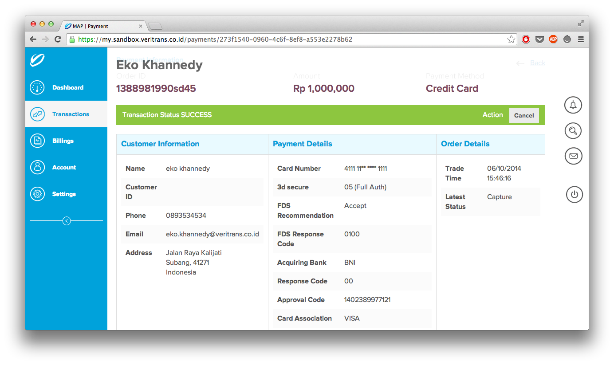

<== [Veritrans Payment API](../03-payment-api/README.md)

4. Transaksi Kartu Kredit
=========================================

Metode pembayaran yang pertama yang akan kita bahas adalah ```credit_card``` (kartu kredit). 

## 4.1 Tahapan Transaksi Kartu Kredit

Dalam transaksi kartu kredit, terdapat dua tahapan yang diperlukan untuk melakukan transaksi;

- Token Request, untuk membuat token_id yang akan digunakan saat proses Charge Request
- Charge Request, mengirim data transaksi + token_id ke Veritrans Payment API

### 4.1.1 Token Request

Token Request merupakan tahapan yang dilakukan sebelum Charge Request. Dalam tahapan Token Request, data kartu kredit akan dikirim dari website Merchant (oleh pelanggan) ke sistem Veritrans Payment API secara client-to-server, bukan server-to-server. Jika dalam browser (aplikasi perambah), data kartu kredit dikirim menggunakan JavaScript ke server Veritrans Payment API.

Data apa saja yang harus dikirim pada tahapan Token Request? Tergantung transaksi apa yang akan dilakukan; misal kartu kredit normal, 3d secure, one click, two click, dan lain-lain. Setiap jenis transaksi kartu kredit punya spefisikasi masing-masing.

Setelah tahapan Token Request berhasil, maka Merchant akan mendapatkan ```token_id``` dari server Veritrans Payment API. Data ```token_id``` tersebut dapat digunakan sebagai perwakilan data kartu kredit. Namun perlu diperhatikan bahwa ```token_id``` hanya dapat digunakan untuk satu kali transaksi, bahkan jika transaksinya gagal, ```token_id``` akan otomatis dihapus dari sistem Veritrans Payment API. ```token_id``` juga hanya bisa digunakan kurang lebih 5 menit setelah token dibuat, jika Merchant terlalu lama melakukan Charge Request setelah mendapatkan ```token_id``` (lebih dari 5 menit), ada kemungkinan ```token_id``` akan dihapus dari server Veritrans Payment API.

#### 4.1.1.1 Kenapa Data Kartu Kredit Tidak Boleh Dikirim server-to-server?

Salah satu ketentuan PCI DSS adalah, data kartu kredit tidak boleh sampai masuk ke server Merchant, walaupun hanya lewat (tidak disimpan di database), tetap data kartu kredit tidak boleh lewat ke server Merchant. Kecuali server Merchant telah lulus sertifikasi PCI DSS.

Dikhawatirkan jika data kartu kredit lewat ke server Merchant, walaupun Merchant tidak menyimpannya (ke dalam database), bisa saja data kartu kredit akan ter-log di log system server Merchant, hal ini bisa berakibat fatal karena data kartu kredit bisa didapatkan oleh pihak yang tidak bertanggung jawab.

### 4.1.2 Charge Request

Setelah mendapatkan ```token_id```, Merchant dapat melakukan proses transaksi dengan mengirim Charge Request ke server Veritrans Payment API yang berisikan data transaksi + ```token_id```. Untuk detail data apa saja yang akan dikirim ke server Veritrans Payment API, kita akan bahas pada sub-bab selanjutnya.

## 4.2 Transaksi Kartu Kredit

Sebelum melakukan transaksi kartu kredit, perlu diketahui bahwa dalam kartu kredit terdapat dua jenis Bank yang bertanggung jawab; Issuing Bank dan Acquiring Bank.

- <b>Issuing Bank</b> adalah pihak Bank yang menerbitkan kartu kredit
- <b>Acquiring Bank</b> adalah pihak Bank yang memproses kartu kredit

Sampai saat ini Veritrans Indonesia telah bekerja sama dengan tiga Acquiring Bank, yaitu CIMB, BNI dan MANDIRI. Walaupun acquiring bank yang digunakan hanya tiga, bukan berarti kartu kredit yang diterbitkan oleh issuing bank BCA dan yang lainnya tidak dapat di proses, tetap dapat diproses. Selain itu sampai saat ini juga Veritrans Indonesia hanya bisa memproses kartu kredit VISA dan MASTERCARD, kartu kredit yang lain seperti AMEX belum bisa diproses oleh Veritrans Indonesia.

### 4.2.1 Transaksi Kartu Kredit

Seperti yang telah dijelaskan sebelumnya, untuk transaksi kartu kredit, terdiri dari dua tahapan; Token Request dan Charge Request. Sekarang kita akan bahas keduanya, data apa saja yang harus kita kirim ke server Veritrans Payment API untuk melakukan transaksi.

#### 4.2.1.1 Token Request Transaksi Kartu Kredit

| API           | Token Request Transaksi Kartu Kredit                  |                                   |
|---------------|-------------------------------------------------------|-----------------------------------|
| HTTP Method   | GET                                                   |                                   |
| Endpoint      | Sanbox : https://api.sandbox.veritrans.co.id/v2/token |                                   |
|               | Production : https://api.veritrans.co.id/v2/token     |                                   |
| URL Parameter | ```card_number```                                     | Nomor Kartu Kredit                |
|               | ```card_cvv```                                        | Nomor CVV Kartu Kredit            |
|               | ```card_exp_month```                                  | 2 Digit Bulan Expire Kartu Kredit |
|               | ```card_exp_year```                                   | 4 Digit Tahun Expire Kartu Kredit |
|               | ```client_key```                                      | Client Key Merchant               |

Untuk melakukan Token Request transaksi kartu kredit, kita hanya perlu mengirim data kartu kredit dan client key ke server Veritrans, nanti Veritrans akan memberikan response seperti berikut ini :

```json
{
    "status_code": "200",
    "status_message": "OK, success request new token",
    "token_id": "411111-1111-08681f2f-b138-4c50-bae5-7ae190aeaca5"
}
```

Veritrans Payment API akan memberikan ```token_id``` yang bisa kita gunakan untuk melakukan Charge Request transaksi kartu kredit. Seperti yang telah dibahas sebelumnya kalo ```token_id``` hanya dapat digunakan satu kali, baik sukses maupun gagal.

#### 4.2.1.2 Charge Request Transaksi Kartu Kredit

| API         | Charge Request Transaksi Kartu Kredit                  |                           |
|-------------|--------------------------------------------------------|---------------------------|
| HTTP Method | POST                                                   |                           |
| Headers     | Content-Type                                           | application/json          |
|             | Accept                                                 | application/json          |
|             | Authorization                                          | Basic BASE64(```server_key```:) |
| Endpoint    | Sanbox : https://api.sandbox.veritrans.co.id/v2/charge |                           |
|             | Production : https://api.veritrans.co.id/v2/charge     |                           |

Body (Contoh) : 

 ```json
{
      "payment_type": "credit_card",
      "transaction_details": {
        "order_id": "138898199044",
        "gross_amount": 1000000
      },
      "item_details": [
        {
          "id": "ITEM1",
          "price": 10000,
          "quantity": 100,
          "name": "Mie Ayam Enak"
        }
      ],
      "customer_details": {
        "first_name" : "eko",
        "last_name" : "khannedy",
        "phone" : "0893534534",
        "email": "eko.khannedy@veritrans.co.id",
        "billing_address": {
          "first_name": "Eko",
          "last_name": "Khannedy",
          "address": "Jalan Raya Kalijati",
          "city": "Subang",
          "postal_code": "41271",
          "phone": "+6281 123 12345",
          "country_code" : "JPN"
        }
      },
      "credit_card": {
        "token_id": "4111113ac32dc1-d528-4eda-a83e-e468e5e02a86"
      }
    }
``` 

Contoh Charge Response yang akan didapatkan oleh Merchant

```json
{
    "status_code": "200",
    "status_message": "OK, Credit Card transaction is successful",
    "transaction_id": "8ce376c8-1f27-4930-b1e9-331d4d46ca3f",
    "order_id": "13889835199045",
    "payment_type": "credit_card",
    "transaction_time": "2014-06-10 16:57:20",
    "transaction_status": "capture",
    "fraud_status": "accept",
    "masked_card": "411111-1111",
    "gross_amount": "1000000.00"
}
```

Jangan lupa untuk menggunakan ```token_id``` yang telah didapatkan pada saat tahapan Token Request.

#### 4.2.1.3 Contoh Transaksi Kartu Kredit

Sekarang kita akan coba melakukan transaksi kartu kredit menggunakan POSTMAN. Silahkan ikuti tutorial berikut :

- [Transaksi Kartu Kredit Menggunakan POSTMAN](transaksi-kartu-kredit.md)
- Screencast Transaksi Kartu Kredit Menggunakan POSTMAN

### 4.2.2 Transaksi Kartu Kredit Installment

#### 4.2.2.1 Token Request Transaksi Kartu Kredit Installment

Token Request dan Token Response untuk transaksi kartu kredit installment sama dengan transaksi kartu kredit normal.

| API           | Token Request Transaksi Kartu Kredit Installment      |                                   |
|---------------|-------------------------------------------------------|-----------------------------------|
| HTTP Method   | GET                                                   |                                   |
| Endpoint      | Sanbox : https://api.sandbox.veritrans.co.id/v2/token |                                   |
|               | Production : https://api.veritrans.co.id/v2/token     |                                   |
| URL Parameter | ```card_number```                                     | Nomor Kartu Kredit                |
|               | ```card_cvv```                                        | Nomor CVV Kartu Kredit            |
|               | ```card_exp_month```                                  | 2 Digit Bulan Expire Kartu Kredit |
|               | ```card_exp_year```                                   | 4 Digit Tahun Expire Kartu Kredit |
|               | ```client_key```                                      | Client Key Merchant               |

#### 4.2.2.2 Charge Request Transaksi Kartu Kredit Installment

| API         | Charge Request Transaksi Kartu Kredit Installment      |                           |
|-------------|--------------------------------------------------------|---------------------------|
| HTTP Method | POST                                                   |                           |
| Headers     | Content-Type                                           | application/json          |
|             | Accept                                                 | application/json          |
|             | Authorization                                          | Basic BASE64(```server_key```:) |
| Endpoint    | Sanbox : https://api.sandbox.veritrans.co.id/v2/charge |                           |
|             | Production : https://api.veritrans.co.id/v2/charge     |                           |

Body (Contoh) : 

 ```json
{
      "payment_type": "credit_card",
      "transaction_details": {
        "order_id": "138898199044",
        "gross_amount": 1000000
      },
      "item_details": [
        {
          "id": "ITEM1",
          "price": 10000,
          "quantity": 100,
          "name": "Mie Ayam Enak"
        }
      ],
      "customer_details": {
        "first_name" : "eko",
        "last_name" : "khannedy",
        "phone" : "0893534534",
        "email": "eko.khannedy@veritrans.co.id",
        "billing_address": {
          "first_name": "Eko",
          "last_name": "Khannedy",
          "address": "Jalan Raya Kalijati",
          "city": "Subang",
          "postal_code": "41271",
          "phone": "+6281 123 12345",
          "country_code" : "JPN"
        }
      },
      "credit_card": {
        "token_id": "4111113ac32dc1-d528-4eda-a83e-e468e5e02a86",
        "installment_term" : 3
      }
    }
``` 

Dalam JSON Body untuk transaksi kartu kredit installment, pertu ditambahkan parameter ```installment_term``` yang berisikan bulan installment (cicilan), misal; 3 (artinya cicilan 3 bulan), 6 (artinya cicilan 6 bulan) dan 12 (artinya cicilan 12 bulan).

Contoh Charge Response yang akan didapatkan oleh Merchant :

```json
{
    "status_code": "200",
    "status_message": "OK, Credit Card Installment transaction is successful",
    "transaction_id": "98c4928e-2d86-46ce-bd8f-9c955210ed5c",
    "order_id": "463464646",
    "payment_type": "credit_card",
    "transaction_time": "2014-06-10 16:59:20",
    "transaction_status": "capture",
    "fraud_status": "accept",
    "masked_card": "411111-1111",
    "gross_amount": "1000000.00"
}
```

#### 4.2.2.3 Contoh Transaksi Kartu Kredit Installment

Sekarang kita akan coba melakukan transaksi kartu kredit installment menggunakan POSTMAN. Silahkan ikuti tutorial berikut :

- [Transaksi Kartu Kredit Installment Menggunakan POSTMAN](transaksi-kartu-kredit-installment.md)
- Screencast Transaksi Kartu Kredit Installment Menggunakan POSTMAN

### 4.2.3 Transaksi Kartu Kredit Point

#### 4.2.3.1 Token Request Transaksi Kartu Kredit Point

Token Request dan Token Response untuk transaksi kartu kredit point sama dengan transaksi kartu kredit normal.

| API           | Token Request Transaksi Kartu Kredit Point            |                                   |
|---------------|-------------------------------------------------------|-----------------------------------|
| HTTP Method   | GET                                                   |                                   |
| Endpoint      | Sanbox : https://api.sandbox.veritrans.co.id/v2/token |                                   |
|               | Production : https://api.veritrans.co.id/v2/token     |                                   |
| URL Parameter | ```card_number```                                     | Nomor Kartu Kredit                |
|               | ```card_cvv```                                        | Nomor CVV Kartu Kredit            |
|               | ```card_exp_month```                                  | 2 Digit Bulan Expire Kartu Kredit |
|               | ```card_exp_year```                                   | 4 Digit Tahun Expire Kartu Kredit |
|               | ```client_key```                                      | Client Key Merchant               |

#### 4.2.3.2 Charge Request Transaksi Kartu Kredit Point

| API         | Charge Request Transaksi Kartu Kredit Point      |                           |
|-------------|--------------------------------------------------------|---------------------------|
| HTTP Method | POST                                                   |                           |
| Headers     | Content-Type                                           | application/json          |
|             | Accept                                                 | application/json          |
|             | Authorization                                          | Basic BASE64(```server_key```:) |
| Endpoint    | Sanbox : https://api.sandbox.veritrans.co.id/v2/charge |                           |
|             | Production : https://api.veritrans.co.id/v2/charge     |                           |

Body (Contoh) : 

 ```json
{
      "payment_type": "credit_card",
      "transaction_details": {
        "order_id": "138898199044",
        "gross_amount": 1000000
      },
      "item_details": [
        {
          "id": "ITEM1",
          "price": 10000,
          "quantity": 100,
          "name": "Mie Ayam Enak"
        }
      ],
      "customer_details": {
        "first_name" : "eko",
        "last_name" : "khannedy",
        "phone" : "0893534534",
        "email": "eko.khannedy@veritrans.co.id",
        "billing_address": {
          "first_name": "Eko",
          "last_name": "Khannedy",
          "address": "Jalan Raya Kalijati",
          "city": "Subang",
          "postal_code": "41271",
          "phone": "+6281 123 12345",
          "country_code" : "JPN"
        }
      },
      "credit_card": {
        "token_id": "4111113ac32dc1-d528-4eda-a83e-e468e5e02a86",
        "point_redeem_amount" : 5000
      }
    }
``` 

Dalam JSON Body untuk transaksi kartu kredit point, pertu ditambahkan parameter ```point_redeem_amount``` yaitu jumlah point (dalam harga) yang akan digunakan dalam transaksi. Misal jika ```gross_amount``` nya 10000, sedangkan ```point_redeem_amount``` nya adalah 5000 artinya transaksi tersebut akan dibayar menggunakan saldo kartu kredit sebanyak 5000 dan point 5000.

Contoh Charge Response yang akan didapatkan oleh Merchant :

```json
{
    "status_code": "200",
    "status_message": "OK, Credit Card Point transaction is successful",
    "transaction_id": "bc9d1e9b-9c43-4075-80bf-896d52d6b94c",
    "order_id": "463asd46346",
    "payment_type": "credit_card",
    "transaction_time": "2014-06-10 17:00:19",
    "transaction_status": "capture",
    "fraud_status": "accept",
    "masked_card": "411111-1111",
    "gross_amount": "1000000.00"
}
```

#### 4.2.2.3 Contoh Transaksi Kartu Kredit Point

Sekarang kita akan coba melakukan transaksi kartu kredit point menggunakan POSTMAN. Silahkan ikuti tutorial berikut :

- [Transaksi Kartu Kredit Point Menggunakan POSTMAN](transaksi-kartu-kredit-point.md)
- Screencast Transaksi Kartu Kredit Point Menggunakan POSTMAN

## 4.3 Transaksi Kartu Kredit 3D Secure

### 4.3.1 Pengenalan 3D Secure

Jika Anda belum mengerti tentang 3D Secure, yuk kita bahas apa itu 3D Secure. 3D Secure adalah kepanjangan dari 3 Domain Secure. 3D Secure di buat untuk agar belanja online lebih aman dengan cara meng-autentikasi pemegang kartu kredit pada saat melakukan pembayaran. 3D Secure lebih dikenal sebagai "Verified by Visa" untuk Visa atau "MasterCard SecureCode" untuk MasterCard.

Proses autentikasi akan dilakukan pada 3 domain, yaitu :

- Acquirer Domain (Merchant, Payment Gateway, dan Acquiring Bank)
- Issuer Domain (Bank yang menerbitkan kartu kredit)
- Interoperability Domain (Directory Server dan Authentication History server yang disediakan oleh card brand, Visa atau MasterCard)

#### 4.3.1.1 Tahapan Proses 3D Secure

Berbeda dengan transaksi kartu kredit normal, proses 3D Secure lebih rumit tahapannya, walaupun proses ini sangat aman, namun kadang 3D secure membuat pelanggan malas untuk berbelanja.

1. Pelanggan melakukan transaksi dan Merchant meminta Veritrans untuk memproses dengan 3D Secure
2. Sistem Veritrans mengirimkan data ke Visa/MasterCard untuk mengetahui apakah kartu kredit telah teregistrasi sebagai 3D Secure.
3. Jika kartu kredit teregistrasi 3D Secure, Visa/MasterCard akan me-redirect pelanggan ke halaman autentikasi Issuer Domain.
4. Pelanggan akan menerima one time token via SMS dari issuer bank dan pelanggan harus memasukkan token yang diterima di halaman autentikasi issuer domain.
5. Setelah proses autentikasi selesai, Veritrans akan memproses transaksi dengan mengirim seluruh datanya ke acquiring bank.

#### 4.3.1.2 Keuntungan dan Kerugian 3D Secure

Mengimplementasikan 3D Secure di sistem pembayaran Merchant memang memiliki keuntungan dan kerugian, diantaranya;

Keuntungan 3D Secure untuk Merchant, Pelanggan dan Bank

- Untuk Merchant, 3D Secure aman dari Fraud (penipuan). Resiko jika terjadi fraud (penipuan) tidak akan dibebankan ke Merchant, namun akan dibebankan ke Issuer Bank, oleh karena itu Merchant akan awan jika terjadi fraud pada transaksi 3D secure.
- Untuk pelanggan, transaksi lebih aman. Hal ini dikarenakan setiap pelanggan perlu melakukan autentikasi one time token ketika melakukan transaksi, sehingga jika pelanggan bukan pemegang kartu kredit, maka otomatis transaksi akan gagal.
- Untuk Acquiring dan Issuing Bank, lebih sedikit fraud (penipuan) dan chargebacks. Setiap chargebacks yang terjadi ketika fraud terjadi akan banyak memakan biaya operasional. Dengan menggunakan 3D Secure proses chargebacks dan fraud akan lebih minimal karena transaksi sangat aman.

Kerugian 3D Secure untuk Merchant, Pelanggan dan Bank

- Untuk Merchant, 3D secure akan membuat volume transaksi menurun, hal ini dikarenakan proses transaksi akan semakin panjang. Banyak pelanggan kadang malas untuk melakukan proses transaksi yang terlalu panjang. Bisa juga para proses transaksi terjadi error, seperti SMS tidak diterima oleh pelanggan, error saat autentikasi, dan lain-lain. Biasanya 3D secure bisa menurunkan 30% dari volumen transaksi.
- Untuk pelangga, proses 3D secure akan membuat tidak nyaman, terutama dengan banyaknya proses yang harus dilakukan. Kebiasaan sering berganti-ganti nomor telpon pun bisa menjadi masalah jika menggunakan 3D secure.
- Untuk Bank, sama seperti Merchant, otomatis volumen transaksi akan menurun.

#### 4.3.1.3 Resiko Fraud untuk 3D Secure

Saat proses autentikasi 3D secure selesai, maka akan menghasilkan sebuah nilai ECI (Ecommerce Indicator). Terdapat tiga jenis ECI di Visa / MasterCard :

- ECI 5 (Visa) / ECI 2 (Master Card). <b>Full Authentication</b>. Hal ini berarti proses autentikasi 3D secure telah berhasil dan kartu kredit teregistrasi 3D Secure. Jika terjadi fraud maka yang bertanggung jawab adalah Issuer Bank.
- ECI 6 (Visa) / ECI 1 (Master Card). <b>Attempted Authentication</b>. Hal ini berarti kartu kredit tidak terdaftar 3D Secure. Jika terjadi fraud maka yang bertanggung jawab adalah Issuer Bank.
- ECI 7 (Visa) / ECI 0 (Master Card). <b>Authentication is unsuccessful or not attempted</b>. Hal ini berarti proses autentikasi gagal, misal pelanggan salah memasukkan one time token. Jika transaksi tetap dilanjutkan, maka transaksi akan dianggap sebagai transaksi normal (Non 3D Secure). Jika terjadi fraud maka yang bertanggung jawab adalah Merchant. Namun di Veritrans jika autentikasi menghasilkan ECI 7 (Visa) / ECI 0 (Master Card), maka transaksi akan ditolak, sehingga Merchant akan aman.

Hasil untuk tiap ECI bisa kita lihat di Veritrans MAP seperti pada gambar dibawah ini :



#### 4.3.1.3 Tahapan Transaksi Kartu Kredit 3D Secure di Veritrans

Tahapan transaksi 3D Secure tidak sama dengan transaksi kartu kredit normal. Ada tahapan pelanggan perlu memasukkan one time token di halaman issuer bank setelah proses Token Request dan sebelum Charge Request. 

Dari mana Merchant tahu website issuer bank untuk melakukan autentikasi one time token? Hal ini sudah ditangani oleh sistem Veritrans. Pada saat tahapan Token Request, Veritrans akan mengembalikan ```redirect_url``` yang berisikan url yang perlu diakses oleh pelanggan untuk melakukan autentikasi one time token. Berikut adalah contoh token response untuk transaksi 3D secure :

```json
{
    "status_code": "200",
    "status_message": "OK, success request new token",
    "token_id": "411111-1111-3fe282c0-1eb8-4f74-91aa-7a23c4c66ef3",
    "redirect_url": "https://api.sandbox.veritrans.co.id/v2/token/redirect/411111-1111-3fe282c0-1eb8-4f74-91aa-7a23c4c66ef3",
    "bank": "bni"
}
```

Token ```token_id``` yang didapat dari Token Request tidak dapat digunakan selama proses autentikasi belum selesai. ```token_id``` baru dapat digunakan jika proses autentikasi telah selesai. 

Untuk tahapan Charge Request, sama saja dengan transaksi kartu kredit non 3D secure, yang membedakan hanyakan parameter yang dikirim ketika Token Request. Untuk lebih detail kita akan bahas di sub-bab selanjutnya.

### 4.3.2 Transaksi Kartu Kredit 3D Secure

#### 4.3.2.1 Token Request Transaksi Kartu Kredit 3D Secure

Token Request untuk transaksi kartu kredit 3D secure sedikit berbeda dengan kartu kredit normal. Berikut adalah spesifikasi untuk Token Request transaksi 3D Secure.

| API           | Token Request Transaksi Kartu Kredit 3D Secure        |                                                          |
|---------------|-------------------------------------------------------|----------------------------------------------------------|
| HTTP Method   | GET                                                   |                                                          |
| Endpoint      | Sanbox : https://api.sandbox.veritrans.co.id/v2/token |                                                          |
|               | Production : https://api.veritrans.co.id/v2/token     |                                                          |
| URL Parameter | ```card_number```                                     | Nomor Kartu Kredit                                       |
|               | ```card_cvv```                                        | Nomor CVV Kartu Kredit                                   |
|               | ```card_exp_month```                                  | 2 Digit Bulan Expire Kartu Kredit                        |
|               | ```card_exp_year```                                   | 4 Digit Tahun Expire Kartu Kredit                        |
|               | ```client_key```                                      | Client Key Merchant                                      |
|               | ```secure```                                          | Harus ```true```                                         |
|               | ```gross_amount```                                    | Total harga transaksi                                    |
|               | ```bank```                                            | [OPTIONAL] Nama acquiring bank (cimb, bni, atau mandiri) |

Ada beberapa parameter tambahan yang diperlukan untuk transaksi 3D secure, yaitu ```secure```, ```gross_amount``` dan ```bank``` (khusus ```bank``` tidak wajib, alias optional).

Parameter ```secure``` harus bernilai ```true``` untuk memberitahukan bahwa Token Request ini untuk transaksi 3D secure. Parameter ```gross_amount``` digunakan untuk menampilkan informasi di halaman issuer bank tentang total biaya transaksi yang akan dilakukan oleh pelanggan. Dan terakhir parameter ```bank``` dapat dikirim jika Merchant ingin menentukan sendiri bank mana yang akan digunakan sebagai acquiring bank.

Response dari Token Request adalah contohnya sebagai berikut :

```json
{
    "status_code": "200",
    "status_message": "OK, success request new token",
    "token_id": "411111-1111-3fe282c0-1eb8-4f74-91aa-7a23c4c66ef3",
    "redirect_url": "https://api.sandbox.veritrans.co.id/v2/token/redirect/411111-1111-3fe282c0-1eb8-4f74-91aa-7a23c4c66ef3",
    "bank": "bni"
}
```

Selanjutnya Merchant perlu meneruskan transaksi ke halaman ```redirect_url``` yang diberikan di Token Response. Proses redirect url tersebut disarankan menggunakan popup dialog atau fancybox (Akan dijelaskan di sub-bab Veritrans JS).

#### 4.3.2.2 Charge Request Transaksi Kartu Kredit 3D Secure

Jika proses autentikasi telah selesai dan ```token_id``` otomatis sudah dapat digunakan. Maka untuk Charge Request transaksi 3D Secure sama dengan transaksi kartu kredit normal (non 3D secure).

| API         | Charge Request Transaksi Kartu Kredit                  |                           |
|-------------|--------------------------------------------------------|---------------------------|
| HTTP Method | POST                                                   |                           |
| Headers     | Content-Type                                           | application/json          |
|             | Accept                                                 | application/json          |
|             | Authorization                                          | Basic BASE64(```server_key```:) |
| Endpoint    | Sanbox : https://api.sandbox.veritrans.co.id/v2/charge |                           |
|             | Production : https://api.veritrans.co.id/v2/charge     |                           |

Body (Contoh) : 

 ```json
{
      "payment_type": "credit_card",
      "transaction_details": {
        "order_id": "138898199044",
        "gross_amount": 1000000
      },
      "item_details": [
        {
          "id": "ITEM1",
          "price": 10000,
          "quantity": 100,
          "name": "Mie Ayam Enak"
        }
      ],
      "customer_details": {
        "first_name" : "eko",
        "last_name" : "khannedy",
        "phone" : "0893534534",
        "email": "eko.khannedy@veritrans.co.id",
        "billing_address": {
          "first_name": "Eko",
          "last_name": "Khannedy",
          "address": "Jalan Raya Kalijati",
          "city": "Subang",
          "postal_code": "41271",
          "phone": "+6281 123 12345",
          "country_code" : "JPN"
        }
      },
      "credit_card": {
        "token_id": "411111-1111-3fe282c0-1eb8-4f74-91aa-7a23c4c66ef3"
      }
    }
``` 

Berikut adalah contoh Charge Response yang didapat oleh Merchant :

```json
{
    "status_code": "200",
    "status_message": "OK, Credit Card 3D Secure transaction is successful",
    "transaction_id": "7bf819f7-d805-481b-81b7-8686a2b9d555",
    "order_id": "138823423598199045",
    "payment_type": "credit_card",
    "transaction_time": "2014-06-10 16:28:22",
    "transaction_status": "capture",
    "fraud_status": "accept",
    "masked_card": "411111-1111",
    "gross_amount": "1000000.00"
}
```

#### 4.3.2.3 Contoh Transaksi Kartu Kredit 3D Secure

Sekarang kita akan coba melakukan transaksi kartu kredit 3D secure menggunakan POSTMAN. Silahkan ikuti tutorial berikut :

- [Transaksi Kartu Kredit 3D Secure Menggunakan POSTMAN](transaksi-kartu-kredit-3d-secure.md)
- Screencast Transaksi Kartu Kredit 3D Secure Menggunakan POSTMAN


### 4.3.3 Transaksi Kartu Kredit 3D Secure Installment

#### 4.3.3.1 Token Request Transaksi Kartu Kredit 3D Secure Installment

| API           | Token Request Transaksi Kartu Kredit 3D Secure Installment           |                                                                               |
|---------------|-------------------------------------------------------|-------------------------------------------------------------------------------|
| HTTP Method   | GET                                                   |                                                                               |
| Endpoint      | Sanbox : https://api.sandbox.veritrans.co.id/v2/token |                                                                               |
|               | Production : https://api.veritrans.co.id/v2/token     |                                                                               |
| URL Parameter | ```card_number```                                     | Nomor Kartu Kredit                                                            |
|               | ```card_cvv```                                        | Nomor CVV Kartu Kredit                                                        |
|               | ```card_exp_month```                                  | 2 Digit Bulan Expire Kartu Kredit                                             |
|               | ```card_exp_year```                                   | 4 Digit Tahun Expire Kartu Kredit                                             |
|               | ```client_key```                                      | Client Key Merchant                                                           |
|               | ```secure```                                          | Harus ```true```                                                              |
|               | ```gross_amount```                                    | Total harga transaksi                                                         |
|               | ```bank```                                            | [OPTIONAL] Nama acquiring bank (cimb, bni, atau mandiri)                      |
|               | ```installment```                                     | Harus ```true```                                                              |
|               | ```installment_term```                                | Bulan installment, misal 3 (untuk 3 bulan cicilan), 6 (untuk 6 bulan cicilan) |

Untuk transaksi 3D secure installment, di tahapan Token Request terdapat beberapa tambahan parameter yaitu ```installment``` yang harus bernilai ```true``` untuk menyatakan kalo itu transaksi installment, dan parameter ```installment_term``` untuk memasukkan berama bulan cicilan yang akan dilakukan.

Untuk Token Response dari Token Request installment, sama dengan transaksi 3D secure biasa, pelanggan perlu melakukan proses autentikasi terlebih dahulu dengan menggunakan ```redirect_url``` yang didapatkan dari Token Response.

#### 4.3.3.2 Charge Request Transaksi Kartu Kredit 3D Secure Installment

| API         | Charge Request Transaksi Kartu Kredit Installment      |                           |
|-------------|--------------------------------------------------------|---------------------------|
| HTTP Method | POST                                                   |                           |
| Headers     | Content-Type                                           | application/json          |
|             | Accept                                                 | application/json          |
|             | Authorization                                          | Basic BASE64(```server_key```:) |
| Endpoint    | Sanbox : https://api.sandbox.veritrans.co.id/v2/charge |                           |
|             | Production : https://api.veritrans.co.id/v2/charge     |                           |

Body (Contoh) : 

 ```json
{
      "payment_type": "credit_card",
      "transaction_details": {
        "order_id": "138898199044",
        "gross_amount": 1000000
      },
      "item_details": [
        {
          "id": "ITEM1",
          "price": 10000,
          "quantity": 100,
          "name": "Mie Ayam Enak"
        }
      ],
      "customer_details": {
        "first_name" : "eko",
        "last_name" : "khannedy",
        "phone" : "0893534534",
        "email": "eko.khannedy@veritrans.co.id",
        "billing_address": {
          "first_name": "Eko",
          "last_name": "Khannedy",
          "address": "Jalan Raya Kalijati",
          "city": "Subang",
          "postal_code": "41271",
          "phone": "+6281 123 12345",
          "country_code" : "JPN"
        }
      },
      "credit_card": {
        "token_id": "4111113ac32dc1-d528-4eda-a83e-e468e5e02a86",
        "installment_term" : 3
      }
    }
``` 

Dalam JSON Body untuk transaksi kartu kredit installment, pertu ditambahkan parameter ```installment_term``` yang berisikan bulan installment (cicilan), misal; 3 (artinya cicilan 3 bulan), 6 (artinya cicilan 6 bulan) dan 12 (artinya cicilan 12 bulan).

Contoh Charge Response yang akan didapatkan oleh Merchant :

```json
{
    "status_code": "200",
    "status_message": "OK, Credit Card 3D Secure Installment transaction is successful",
    "transaction_id": "34877ce8-66f0-49ba-9802-d47d8d3f7503",
    "order_id": "46346",
    "payment_type": "credit_card",
    "transaction_time": "2014-06-10 16:52:50",
    "transaction_status": "capture",
    "fraud_status": "accept",
    "masked_card": "411111-1111",
    "gross_amount": "1000000.00"
}
```

#### 4.3.3.3 Contoh Transaksi Kartu Kredit 3D Secure Installment

Sekarang kita akan coba melakukan transaksi kartu kredit 3D secure installment menggunakan POSTMAN. Silahkan ikuti tutorial berikut :

- [Transaksi Kartu Kredit 3D Secure Installment Menggunakan POSTMAN](transaksi-kartu-kredit-3d-secure-installment.md)
- Screencast Transaksi Kartu Kredit 3D Secure Installment Menggunakan POSTMAN


### 4.3.4 Transaksi Kartu Kredit 3D Secure Point

#### 4.3.4.1 Token Request Transaksi Kartu Kredit 3D Secure Point

| API           | Token Request Transaksi Kartu Kredit 3D Secure Point           |                                                          |
|---------------|-------------------------------------------------------|----------------------------------------------------------|
| HTTP Method   | GET                                                   |                                                          |
| Endpoint      | Sanbox : https://api.sandbox.veritrans.co.id/v2/token |                                                          |
|               | Production : https://api.veritrans.co.id/v2/token     |                                                          |
| URL Parameter | ```card_number```                                     | Nomor Kartu Kredit                                       |
|               | ```card_cvv```                                        | Nomor CVV Kartu Kredit                                   |
|               | ```card_exp_month```                                  | 2 Digit Bulan Expire Kartu Kredit                        |
|               | ```card_exp_year```                                   | 4 Digit Tahun Expire Kartu Kredit                        |
|               | ```client_key```                                      | Client Key Merchant                                      |
|               | ```secure```                                          | Harus ```true```                                         |
|               | ```gross_amount```                                    | Total harga transaksi                                    |
|               | ```bank```                                            | [OPTIONAL] Nama acquiring bank (cimb, bni, atau mandiri) |
|               | ```point```                                           | Harus ```true```                                         |

Untuk Token Request transaksi 3D secure point, merchant hanya perlu menambahkan parameter ```point``` dengan nilai ```true``` yang menyatakan bahwa transaksinya adalah transaksi point.

Untuk Token Response dari Token Request point, sama dengan transaksi 3D secure biasa, pelanggan perlu melakukan proses autentikasi terlebih dahulu dengan menggunakan ```redirect_url``` yang didapatkan dari Token Response.

#### 4.3.4.2 Charge Request Transaksi Kartu Kredit 3D Secure Point

| API         | Charge Request Transaksi Kartu Kredit 3D Secure Point      |                           |
|-------------|--------------------------------------------------------|---------------------------|
| HTTP Method | POST                                                   |                           |
| Headers     | Content-Type                                           | application/json          |
|             | Accept                                                 | application/json          |
|             | Authorization                                          | Basic BASE64(```server_key```:) |
| Endpoint    | Sanbox : https://api.sandbox.veritrans.co.id/v2/charge |                           |
|             | Production : https://api.veritrans.co.id/v2/charge     |                           |

Body (Contoh) : 

 ```json
{
      "payment_type": "credit_card",
      "transaction_details": {
        "order_id": "138898199044",
        "gross_amount": 1000000
      },
      "item_details": [
        {
          "id": "ITEM1",
          "price": 10000,
          "quantity": 100,
          "name": "Mie Ayam Enak"
        }
      ],
      "customer_details": {
        "first_name" : "eko",
        "last_name" : "khannedy",
        "phone" : "0893534534",
        "email": "eko.khannedy@veritrans.co.id",
        "billing_address": {
          "first_name": "Eko",
          "last_name": "Khannedy",
          "address": "Jalan Raya Kalijati",
          "city": "Subang",
          "postal_code": "41271",
          "phone": "+6281 123 12345",
          "country_code" : "JPN"
        }
      },
      "credit_card": {
        "token_id": "4111113ac32dc1-d528-4eda-a83e-e468e5e02a86",
        "point_redeem_amount" : 5000
      }
    }
``` 

Dalam JSON Body untuk transaksi kartu kredit point, pertu ditambahkan parameter ```point_redeem_amount``` yaitu jumlah point (dalam harga) yang akan digunakan dalam transaksi. Misal jika ```gross_amount``` nya 10000, sedangkan ```point_redeem_amount``` nya adalah 5000 artinya transaksi tersebut akan dibayar menggunakan saldo kartu kredit sebanyak 5000 dan point 5000.

Contoh Charge Response yang akan didapatkan oleh Merchant :

```json
{
    "status_code": "200",
    "status_message": "OK, Credit Card 3D Secure Point transaction is successful",
    "transaction_id": "fd4872c4-88cd-48a0-af35-1113215d2569",
    "order_id": "46346346",
    "payment_type": "credit_card",
    "transaction_time": "2014-06-10 16:52:00",
    "transaction_status": "capture",
    "fraud_status": "accept",
    "masked_card": "411111-1111",
    "gross_amount": "1000000.00"
}
```

#### 4.3.4.3 Contoh Transaksi Kartu Kredit 3D Secure Point

Sekarang kita akan coba melakukan transaksi kartu kredit 3D secure point menggunakan POSTMAN. Silahkan ikuti tutorial berikut :

- [Transaksi Kartu Kredit 3D Secure Point Menggunakan POSTMAN](transaksi-kartu-kredit-3d-secure-point.md)
- Screencast Transaksi Kartu Kredit 3D Secure Point Menggunakan POSTMAN

## 4.4 Transaksi Kartu Kredit One Click Button

One Click Button merupakan fitur yang banyak diinginkan oleh Merchant dan Pelanggan. Bayangkan hanya dengan satu klik, pelanggan bisa melakukan transaksi online tanpa harus ribet memasukkan data kartu kredit nya setiap kali melakukan transaksi.

Namun perlu diketahui bahwa di Indonesia, tidak semua acquiring bank mendukung One Click Button atau lebih dikenal dengan transaksi <i>recurring</i>. Untuk saatnya hanya acquiring bank BNI yang mendukung transaksi recurring, oleh karena itu jika Merchant ingin menambahkan fitur One Click Button di sistem-nya, Merchant perlu melakukan kerja sama dengan acquiring bank BNI.

### 4.4.1 Tahapan Transaksi Kartu Kredit One Click Button

Sebelum merchant dan pelanggan bisa melakukan transaksi one click button, sebelumnya pelanggan harus melakukan transaksi 3D secure. Jika transaksi 3D secure tersebut sukses, maka transaksi selanjutnya baru bisa melakukan transaksi one click button.

Pada tahapan transaksi 3D secure permata kali, Merchant perlu menambahkan parameter ```save_token_id``` pada saat Charge Request transaksi 3D secure. Parameter tersebut digunakan untuk meminta Veritrans membuatkan one click token yang bisa digunakan untuk transaksi selanjutnya.

Berikut contoh Charge Request transaksi 3D secure pertama :

```json
{
      "payment_type": "credit_card",
      ...,
      "credit_card": {
        "token_id": "411111-1111-30edf4be-72fe-47f4-bf4b-a45e7372f9bf",
        "save_token_id" : true
      }
    }
```

Jika transaksi sukses, maka Veritrans akan memberikan Charge Response seperti berikut ini :

```json
{
    "status_code": "200",
    "status_message": "OK, Credit Card 3D Secure transaction is successful",
    "transaction_id": "1365c5cb-c68f-4962-b4b9-5d81434e67b0",
    "order_id": "14578199045",
    "payment_type": "credit_card",
    "transaction_time": "2014-06-10 17:55:21",
    "transaction_status": "capture",
    "fraud_status": "accept",
    "masked_card": "411111-1111",
    "saved_token_id": "41111106438ffc-b169-424f-bf9f-e277c56a8972",
    "saved_token_id_expired_at": "2024-06-10 17:55:21",
    "gross_amount": "1000000.00"
}
```

Merchant akan mendapatkan data one click token di parameter ```saved_token_id``` yang dapat disimpan di server Merchant untuk melakukan transaksi selanjutnya untuk pelanggan tersebut. Sampai kapan one click token dapat digunakan? Merchant bisa melihat masa valid one click token pada parameter ```saved_token_id_expired_at```.

### 4.4.2 Transaksi Kartu Kredit One Click Button

Untuk melakukan transaksi kartu kredit one click button, sama seperti transaksi normal dan transaksi 3D secure. Yang membedakan adalah kita tidak perlu melakukan Token Request lagi, cukup gunakan Charge Request langsung menggunakan ```token_id``` yang didapat dari ```saved_token_id``` pada transaksi 3d secure pertama kali.

| API         | Charge Request Transaksi Kartu Kredit One Click Button      |                           |
|-------------|--------------------------------------------------------|---------------------------|
| HTTP Method | POST                                                   |                           |
| Headers     | Content-Type                                           | application/json          |
|             | Accept                                                 | application/json          |
|             | Authorization                                          | Basic BASE64(```server_key```:) |
| Endpoint    | Sanbox : https://api.sandbox.veritrans.co.id/v2/charge |                           |
|             | Production : https://api.veritrans.co.id/v2/charge     |                           |

Body (Contoh) : 

 ```json
{
      "payment_type": "credit_card",
      "transaction_details": {
        "order_id": "138898199044",
        "gross_amount": 1000000
      },
      "item_details": [
        {
          "id": "ITEM1",
          "price": 10000,
          "quantity": 100,
          "name": "Mie Ayam Enak"
        }
      ],
      "customer_details": {
        "first_name" : "eko",
        "last_name" : "khannedy",
        "phone" : "0893534534",
        "email": "eko.khannedy@veritrans.co.id",
        "billing_address": {
          "first_name": "Eko",
          "last_name": "Khannedy",
          "address": "Jalan Raya Kalijati",
          "city": "Subang",
          "postal_code": "41271",
          "phone": "+6281 123 12345",
          "country_code" : "JPN"
        }
      },
      "credit_card": {
        "token_id": "41111106438ffc-b169-424f-bf9f-e277c56a8972",
      }
    }
``` 

Pastikan ```token_id``` yang dikirim adalah ```saved_token_id``` yang didapat dari transaksi 3d secure pertama kali. Berikut adalah contoh response transaksi one click button :

```json
{
    "status_code": "200",
    "status_message": "OK, Credit Card transaction is successful",
    "transaction_id": "cf496679-587d-40b6-9298-0b5703ea3972",
    "order_id": "138898145645699045",
    "payment_type": "credit_card",
    "transaction_time": "2014-06-10 18:05:41",
    "transaction_status": "capture",
    "gross_amount": "1000000.00"
}
```

### 4.4.3 Contoh Transaksi Kartu Kredit One Click Button

Sekarang kita akan coba melakukan transaksi kartu kredit one click button menggunakan POSTMAN. Silahkan ikuti tutorial berikut :

- [Transaksi Kartu Kredit One Click Button Menggunakan POSTMAN](transaksi-kartu-kredit-one-click-button.md)
- Screencast Transaksi Kartu One Click Button Menggunakan POSTMAN

## 4.5 Transaksi Kartu Kredit Two Click Button 

Selain transaksi one click button, salah satu feature yang menarik yang disediakan oleh Veritrans adalah two click button. Yang jadi pertanyaan adalah apa itu transaksi two click button?

### 4.5.1 Apa itu Two Click Button?

Transaksi Two Click Button sebenarnya adalah feature menarik yang disediakan oleh Veritrans untuk mempermudah transaksi kartu kredit normal. Semua transaksi two click button sebenarnya adalah transaksi kartu kredit normal. Lantas seperti apa transaksi two click button?

Transaksi two click button merupakan transaksi yang mirip seperti one click button. Transaksi two click button hanya dapat dilakukan jika Merchant telah memiliki ```saved_token_id``` dari transaksi pertama 3D secure. Yang membedakan dengan transaksi one click button adalah, untuk transaksi two click button, pelanggan perlu memasukkan data cvv. Walaupun lebih ribet dibandingkan dengan one click button, namun transaksi two click button lebih ringkas dari transaksi normal, karena hanya perlu memasukkan data cvv pada transaksi selanjutnya, sedangkan transaksi normal harus memasukkan seluruh data kartu kredit setiap kali melakukan transaksi.

### 4.5.2 Tahapan Transaksi Two Click Button

Tahapan transaksi two click button sebenarnya sama dengan one click button, yang membedakan adalah sebelum tahapan Charge Request setelah mendapatkan ```saved_token_id```, merchant harus melakukan Token Request CVV.

#### 4.5.2.1 Token Request CVV

Token Request CVV adalah tahapan dimana data cvv di kirim ke Veritrans dan Veritrans akan mengembalikan token cvv id. Berikut adalah spesifikasi Token Request CVV :


| API           | Token Request CVV Two Click Button           |                                                                               |
|---------------|-------------------------------------------------------|-------------------------------------------------------------------------------|
| HTTP Method   | GET                                                   |                                                                               |
| Endpoint      | Sanbox : https://api.sandbox.veritrans.co.id/v2/token |                                                                               |
|               | Production : https://api.veritrans.co.id/v2/token     |                                                                               |
| URL Parameter | ```card_cvv```                                     | Nomor CVV Kartu Kredit                                                            |
|               | ```client_key```                                      | Client Key Merchant                                                           |
|               | ```two_click```                                | Harus bernilai ```true``` |

Berikut adalah contoh Token CVV Response :

```json
{
    "status_code": "200",
    "status_message": "OK, success request new token",
    "token_id": "9a09ad9e-9c90-4c2d-bce7-56eaa2f9b315"
}
```

> Perlu diketahui jika Token CVV hanya bisa digunakan untuk sekali transaksi, sehingga untuk setiap transaksi Merchant harus membuat token cvv lagi. Namun ini lebih baik dibandingkan harus memasukkan seluruh data kartu kredit.

#### 4.5.2.2 Charge Request Two Click

| API         | Charge Request Transaksi Kartu Kredit Two Click Button      |                           |
|-------------|--------------------------------------------------------|---------------------------|
| HTTP Method | POST                                                   |                           |
| Headers     | Content-Type                                           | application/json          |
|             | Accept                                                 | application/json          |
|             | Authorization                                          | Basic BASE64(```server_key```:) |
| Endpoint    | Sanbox : https://api.sandbox.veritrans.co.id/v2/charge |                           |
|             | Production : https://api.veritrans.co.id/v2/charge     |                           |

Body (Contoh) : 

 ```json
{
      "payment_type": "credit_card",
      "transaction_details": {
        "order_id": "138898199044",
        "gross_amount": 1000000
      },
      "item_details": [
        {
          "id": "ITEM1",
          "price": 10000,
          "quantity": 100,
          "name": "Mie Ayam Enak"
        }
      ],
      "customer_details": {
        "first_name" : "eko",
        "last_name" : "khannedy",
        "phone" : "0893534534",
        "email": "eko.khannedy@veritrans.co.id",
        "billing_address": {
          "first_name": "Eko",
          "last_name": "Khannedy",
          "address": "Jalan Raya Kalijati",
          "city": "Subang",
          "postal_code": "41271",
          "phone": "+6281 123 12345",
          "country_code" : "JPN"
        }
      },
      "credit_card": {
        "token_id": "41111106438ffc-b169-424f-bf9f-e277c56a8972",
        "token_cvv_id": "9a09ad9e-9c90-4c2d-bce7-56eaa2f9b315"
      }
    }
``` 

Perlu diperhatikan untuk parameter ```token_id``` harus berisi ```saved_token_id``` hasil dari transaksi 3D secure pertama kali, sedangkan parameter ```token_cvv_id``` harus berisi token yang didapat dari tahapan Token Request CVV. Berikut adalah contoh hasil transaksi kartu kredit two click button.

```json
{
    "status_code": "200",
    "status_message": "OK, Credit Card transaction is successful",
    "transaction_id": "1bc66f26-d9aa-4e3f-b6f4-79e1d2209474",
    "order_id": "138898saf199045",
    "payment_type": "credit_card",
    "transaction_time": "2014-06-10 18:56:58",
    "transaction_status": "capture",
    "gross_amount": "1000000.00"
}
```

### 4.5.3 Acquiring Bank Apa yang Mendukung Two Click Button?

Karena sebenarnya two click button adalah transaksi kartu kredit normal, jadi semua acquiring bank yang mendukung 3D secure bisa menggunakan transaksi two click button. Kenapa harus bank yang mendukung 3D secure? Karena transaksi pertama kali sebelum transaksi two click button harus transaksi 3D secure.

### 4.5.4 Contoh Transaksi Kartu Kredit Two Click Button

Sekarang kita akan coba melakukan transaksi kartu kredit two click button menggunakan POSTMAN. Silahkan ikuti tutorial berikut :

- [Transaksi Kartu Kredit Two Click Button Menggunakan POSTMAN](transaksi-kartu-kredit-two-click-button.md)
- Screencast Transaksi Kartu Two Click Button Menggunakan POSTMAN

## 4.6 Menggunakan Veritrans JavaScript Client

Salah satu target utama Veritrans Payment API adalah untuk website toko online, oleh karena itu untuk mempermudah integrasi transaksi kartu kredit, Veritrans menyediakan JavaScript Client untuk melakukan Token Request.

Berikut adalah lokasi Veritrans JavaScript Client yang bisa kita gunakan untuk sandbox dan production.

|            | Veritrans JS Endpoint                                             |
|------------|-------------------------------------------------------------------|
| Sandbox    | https://api.sandbox.veritrans.co.id/v2/assets/js/veritrans.min.js |
| Production | https://api.veritrans.co.id/v2/assets/js/veritrans.min.js         |

Berikut adalah contoh penggunaan Veritrans JavaScript Client :

```html
	<script src="https://api.sandbox.veritrans.co.id/v2/assets/js/veritrans.min.js"></script>
```

```javascript
    function _payment() {
    	// Client key merchant
        Veritrans.client_key = "e668b029-db9d-46fd-b863-e9056f404204";

        // Token endpoint, pastikan menuju sandbox atau production
        Veritrans.url = "https://api.sandbox.veritrans.co.id/v2/token";

		// Melakukan proses token request, liat sub-bab selanjutnya
        Veritrans.token(_request, _callback);
    }
```

### 4.6.1 Menggunakan Veritrans JS untuk Transaksi Kartu Kredit

Sekarang kita akan bahas tentang Veritrans JS untuk transaksi kartu kredit normal, point dan installment. Penggunaan Veritrans JS sebenarnya sangat mudah, kita hanya perlu menggunakan ```Veritrans.token(_request, _callback)``` untuk melakukan token request, parameter ```_request``` merupakan function yang mengembalikan data object request,  sedangkan ```_callback``` merupakan function callback token response. Berikut adalah contohnya :

```javascript
    function _callback(response) {
        if (response.status_code == '200') {
			// Token Request Success
			alert(response.token_id);
        } else {
            // Token Request Failed
            alert(response.status_message);
        }
    }

    function _request() {
        return {
            "card_number": "4111111111111111",
            "card_exp_month": "10",
            "card_exp_year": "2018",
            "card_cvv": "123"
        }
    }
```

### 4.6.2 Menggunakan Veritrans JS untuk Transaksi Kartu Kredit 3D Secure

Untuk transaksi kartu kredit 3D secure, yang berbeda dengan transaksi kartu kredit normal adalah tambahan request pada function ```_request``` dan handler callback untuk membuat dialog autentikasi 3D secure. Berikut adalah contohnya :

```javascript
    function _callback(response) {
        if (response.redirect_url) {
            // Transaksi 3D secure, silahkan buka redirect_url
            _open_dialog(response.redirect_url); // Hanya contoh
        } else if (response.status_code == '200') {
            // Sukses 3D Secure Authentication
			alert(response.token_id);
        } else {
            // Gagal Token Request atau Gagal Authentication
			alert(response.status_message);
        }
    }

    function _request() {
        return {
            "card_number": "4111111111111111",
            "card_exp_month": "10",
            "card_exp_year": "2018",
            "card_cvv": "123",
            
            // Wajib untuk 3D Secure Transaction
            "secure": true,
            "gross_amount": 10000,
            
            // Untuk 3D Secure Installment
            "installment" : true,
            "installment_term" : 6,
            
            // Untuk 3D Secure Point
            "point" : true
        }
    }
```

### 4.6.3 Menggunakan Veritrans JS untuk Transaksi Kartu Kredit Two Click Button

Seperti yang telah dibahas sebelumnya, bahwa di transaksi two click button, terdapat tahapan Token Request Cvv. Hal itupun bisa dilakukan menggunakan Veritrans JS Client. Berbeda dengan token request biasanya yang menggunakan function ```Veritrans.token(...)```, untuk token request cvv, menggunakan ```Veritrans.tokenCvv(...)``` seperti pada contoh berikut ini :

```javascript
    function _payment() {
    	// Client key merchant
        Veritrans.client_key = "e668b029-db9d-46fd-b863-e9056f404204";

        // Token endpoint, pastikan menuju sandbox atau production
        Veritrans.url = "https://api.sandbox.veritrans.co.id/v2/token";

		// Token Request CVV
        Veritrans.tokenCvv(_request, _callback);
    }
    
	function _callback(response) {
        if (response.status_code == '200') {
            // success token cvv
			alert(response.token_id);
        } else {
            // failed request token cvv
            alert(response.status_message);
        }
    }

    function _request() {
        return {
            "card_cvv": "123"
        }
    }
```

## 4.7 Contoh Data Sandbox Veritrans

Jika Anda ingin melakukan simulasi transaksi di sistem Sandbox Veritrans Indonesia, kita bisa menggunakan contoh data yang sediakan oleh Veritrans Indonesia.

### 4.7.1 Contoh Data Kartu Kredit

Berikut adalah contoh data kartu kredit yang bisa digunakan untuk melakukan transaksi di Sandbox Veritrans Indonesia.

- 4111111111111111 : Accept
- 4012000033330026 : Deny

### 4.7.2 Contoh Data Kartu Kredit 3D Secure

Berikut adalah contoh data kartu kredit 3D secure yang bisa digunakan untuk melakukan transaksi di Sandbox Veritrans Indonesia.

- 4111111111111111 : ECI 5
- 4012000033330026 : ECI 6
- 4444414444444441 : ECI 7

### 4.7.3 Contoh Data Fraud Status

Berikut adalah contoh data ```first_name``` yang bisa digunakan untuk simulasi ```fraud_status``` di Sandbox Veritrans Indonesia.

- Eko : Accept
- Dichi : Challenge
- Chandra : Deny

==> [Pengenalan Callback & Notification](../05-callback-notification/README.md)

