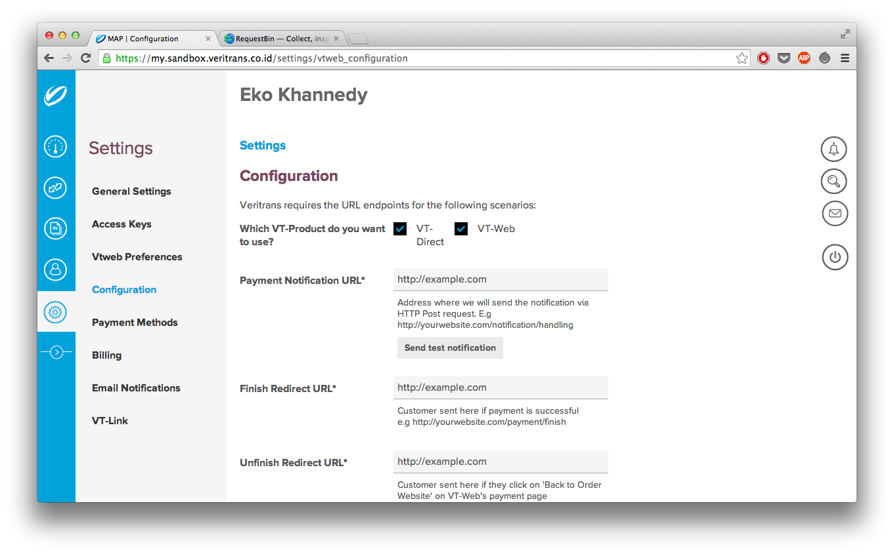
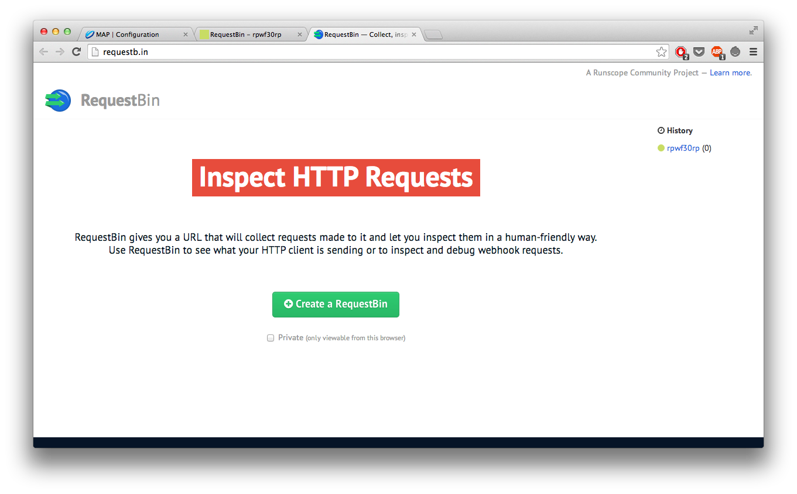
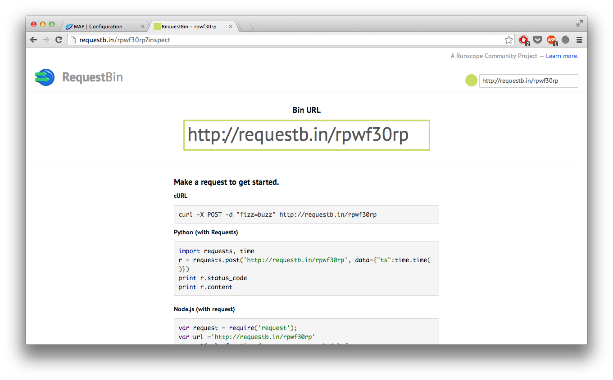
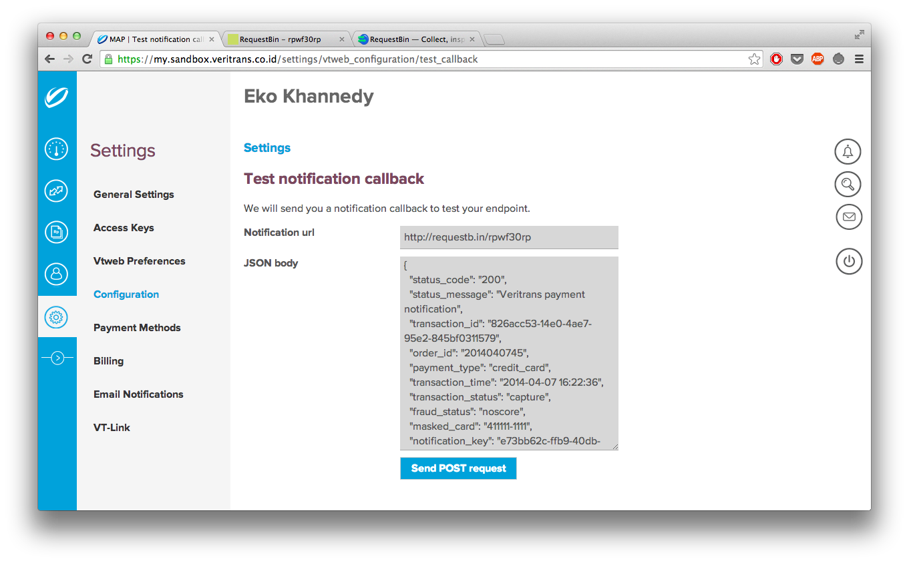
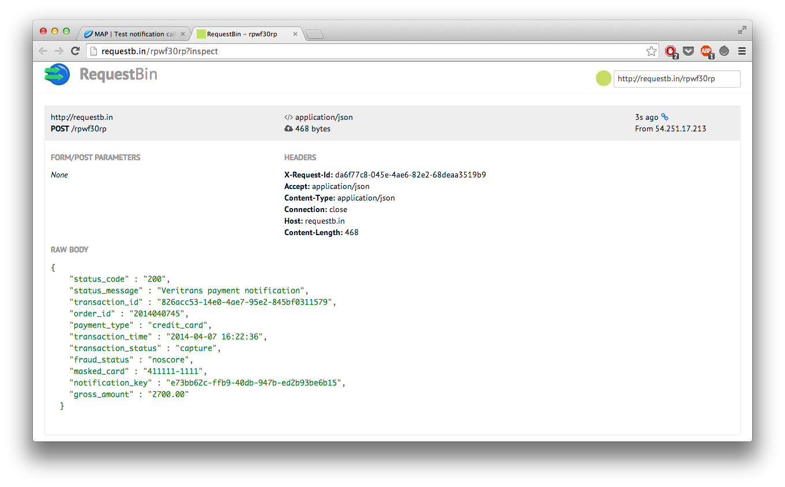

5. Pengenalan Callback & Notification
=========================================

Sebelum kita lanjut membahas tentang transaksi selain kartu kredit, ada hal yang perlu diketahui terlebih dahulu oleh merchant, yaitu Callback dan Notification.

## 5.1 Notification

Setiap transaksi terjadi dan perubahan status transaksi terjadi, maka sistem Veritrans Payment API akan mengirim notifikasi server-to-server ke Merchant yang berisikan data lengkap status terakhir transaksi. Notifikasi tersebut akan dikirim melalui HTTP POST notification dimana body content-nya akan berisikan JSON seperti berikut :

```json
{
  "status_code": "200",
  "status_message": "Veritrans payment notification",
  "transaction_id": "826acc53-14e0-4ae7-95e2-845bf0311579",
  "order_id": "2014040745",
  "payment_type": "credit_card",
  "transaction_time": "2014-04-07 16:22:36",
  "transaction_status": "capture",
  "fraud_status": "accept",
  "masked_card": "411111-1111",
  "notification_key": "e73bb62c-ffb9-40db-947b-ed2b93be6b15",
  "gross_amount": "2700.00"
}
```

Endpoint notifikasi dapat diatur oleh merchant di MAP di bagian Setting => Configuration.



Merchant bisa menentukan lokasi endpoint notifikasi di form Payment Notification URL. Untuk mencoba melakukan notifikasi, kita bisa memanfaatkan [RequestBin](http://requestb.in/).



Coba buat sebuah url RequestBin, lalu simpan di Payment Notification URL. 



Untuk mencobanya, kita bisa menggunakan tombol "Send test notification".



Jika berhasil, data akan terkirim ke endpoint Payment Notification URL.



### 5.1.1 Apa itu ```notification_key```

Dalam data notifikasi, terdapat data ```notification_key```, yaitu berisikan data server key Merchant. Hal ini bisa digunakan oleh merchant untuk memastikan bahwa data notifikasi menang benar dikirim oleh Veritrans Payment API karena yang tahu data server key hanyalah Veritrans dan Merchant.

## 5.2 Callback